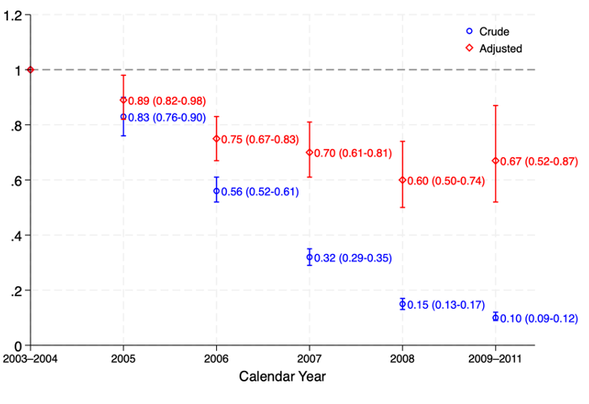

# 📊 Analysis of Childhood Diarrhoea in Ugandan Cohort

This document outlines the full analytical workflow for the investigation of diarrhoea incidence in a Ugandan birth cohort, including descriptive summaries, incidence estimation, time trend assessments, and preliminary regression modeling. All analyses were conducted using STATA.

---

## 🔍 Descriptive Analysis

### 1. Study Period: Date Range Check

*The cohort includes children born between 17 April 2003 and 19 April 2006, and they were followed up until 29 March 2011. Thus, the study period spans from April 2003 to March 2011.*

### 2. Diarrhoea Episodes

*Among 2,315 children, 1,832 (79.14%) experienced at least one episode.*

### 3. Exit Status
*1,614 (69.7%) completed follow-up, 111 (4.8%) died, 590 (25.5%) lost to follow-up.*

### 4. Exit by Diarrhoea Status
*Suggests outcome ascertainment may depend on clinic contact (p < 0.001).* 

### 5. Maternal Infection Missingness
*Maternal infection data were nearly complete. Hookworm status was available for 99.6% of participants, mansonella for 99.7%, and malaria for 98.1%.*
*The small number of missing values (<2%) were coded as a separate category in preliminary tabulations but were excluded from regression models unless otherwise stated.*

### 6. Birthweight Categorisation
*Birthweight was categorised using the clinical cutoff of 2.5 kg: low (<2.5 kg), normal (≥2.5 kg), and missing.
This allowed clearer descriptive summaries and ensured consistency in regression models.*

### 7. Socioeconomic Status (SES) Grouping
*The original 6-level SES variable was collapsed into 4 categories to reduce sparsity and improve interpretability:
– Low (1–2), Lower-middle (3), Upper-middle (4), and High (5–6).*

### 8. Mother's Age Group Regrouping
*The top two maternal age groups (35–39 and 40+) were combined into a single “30+” category.
Final groupings were: 14–19, 20–24, 25–29, and 30+.*

---

## 📈 Incidence Rate Estimation

### Based on First Event Only
*2,803.9 person-years; On average, each child was followed for ~1.2 years.*

### Recurrent Events Approach (Preferred)
*6,117 events over 9,549.1 person-years. Event rate = 661 per 1,000 PY. LRT p < 0.001.*

---

## 🧪 Crude Rates by Covariates
*Repeated for each covariate to obtain crude incidence rates.*

---

## 📊 Time Trends

### i. Age Band
*Age showed strong evidence of association with incidence rate (p < 0.001).*

### ii. Calendar Year
*Steep decline in incidence over time; calendar year (p < 0.001).*

### iii. Season
*No evidence of association (p = 0.85).*

### iv. Mutual Adjustment: Age and Calendar Year
*Mutual adjustment confirmed that both age and calendar year remained independently associated with incidence rate (LRT p < 0.001 for each).*

## 📊 Visualisation of Incidence Rate Ratios

### Incidence Rate Ratios by Age Band (Crude vs Adjusted)

### Incidence Rate Ratios by Calendar Year (Crude vs Adjusted)

---

## ⚙️ Modelling Strategy and Variable Handling

All regression analyses were based on a **Poisson random effects model** with a **gamma-distributed frailty** term to account for within-child clustering. This approach was selected over Cox regression because the data involved **recurrent events within individuals**.

Covariates were grouped or transformed based on subject-matter knowledge and clinical interpretability:

- **Age**: Categorised into 0–6 months, 6–12 months, and one-year bands thereafter (up to 5 years).
- **Calendar Year**: Grouped as 2003–2004, then individual years (2005 to 2008), and 2009–2011.
- **Season**: Grouped into wet (Mar–May and Sep–Dec) and dry (Jan–Feb and Jun–Aug) based on Uganda’s seasonal pattern.

For causal models, a **backward approach** was applied to obtain most interpretable and stable estimates.
**A priori time-varying confounders (age, calendar year, season)** were retained in all models. Other covariates were retained unless their exclusion reduced the log standard error of the exposure coefficient by at least twofold.

Specific variable handling decisions included:

- **Birthweight**: Categorised into low (<2.5 kg), normal (≥2.5 kg), and missing.
- **Household SES**: Collapsed from six to four categories (Low = 1–2; Lower-middle = 3; Upper-middle = 4; High = 5–6).
- **Maternal Age**: Modelled as a continuous variable to preserve statistical power.
- **Wall material and electricity supply**: Evaluated for collinearity with SES.
- **Immunisation site**: Excluded due to speculative interpretation; location already included.
- **Ordinal vs unordered treatment**: Ordinal variables (maternal parity, education) were modelled as linear trends; others as categorical.

Likelihood ratio tests (LRTs) were used to assess evidence for associations and interactions after full adjustment.

## 🧮 Causal Modelling: Maternal Infections and Recurrence

### **Objectives**

Two primary questions were assessed:

1. **Does maternal infection during pregnancy** (hookworm, mansonella, or malaria) influence the incidence of diarrhoea in early childhood?
2. **Does the number of prior diarrhoea episodes** predict recurrence?

---

### **Modelling Approach**

- Regression used a **Poisson random effects model** with a **gamma-distributed frailty** term to account for within-child clustering.
- Analyses were adjusted for **a priori time-varying confounders**: age, calendar year, and season.
- Fully adjusted models included child, maternal, and household-level factors, as well as co-infections.
- **Mediators** (e.g. birthweight and previous diarrhoea episodes in maternal infection models) were excluded from adjustment.
- **Effect modification** was assessed for household SES and child HIV status.
- Covariates were retained unless excluding them reduced the **log standard error of the exposure coefficient by at least half**.

---

## 🔬 Results: Maternal Infections

- **Hookworm** and **mansonella** infections during pregnancy were associated with approximately **10% reduction** in diarrhoea incidence, even after full adjustment.
- **Malaria** showed no evidence of association with childhood diarrhoea.
- No evidence of **effect modification** by child HIV status for any infection.
- **Strong evidence of interaction** between malaria and **household SES** (p = 0.04):
  - Among **low SES households**, malaria infection was associated with lower diarrhoea incidence: RR = 0.64 (95% CI: 0.45–0.93).
  - No clear association in other SES groups.

📎 *See* `outputs/table2_maternal_infection_rrs.png` *and* `outputs/table3_malaria_ses_interaction.png` *for full results.*

---

## 🔁 Results: Prior Diarrhoea and Recurrence

- **Limited evidence** that the number of previous episodes predicted recurrence (p = 0.06).
- After full adjustment:
  - Children with one prior episode had slightly higher recurrence: RR = 1.12 (95% CI: 1.01–1.25).
  - No consistent trend across higher exposure categories.
- **Strong evidence of effect modification** by **child HIV status** (interaction p = 0.004):
  - Among **HIV-positive children**, a **dose-response** relationship was observed:
    - Children with 5+ previous episodes had **2.73 times the rate** (95% CI: 1.59–4.70) of recurrence.
  - Among **HIV-negative children**, no clear association.

📎 *See* `outputs/table4_prev_episodes_rrs.png` *and* `outputs/table5_hiv_interaction.png` *for stratified estimates.*

